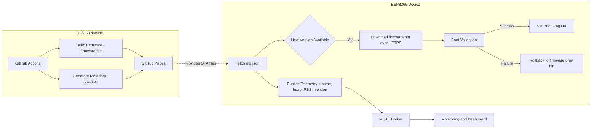

# ESP8266 OTA Pipeline with Rollback and MQTT Telemetry

This project demonstrates a DevOps-inspired pipeline for **safe Over-The-Air (OTA) firmware updates** on ESP8266 devices.  
It combines **CI/CD practices** with **rollback safety mechanisms** and **real-time telemetry reporting** over MQTT.

---

## Features

- **Automatic OTA Delivery**  
  New firmware is built via GitHub Actions and deployed to GitHub Pages for distribution.

- **Firmware Rollback**  
  If an update fails to boot, the ESP8266 automatically rolls back to the previous firmware version.

- **Boot Validation**  
  Each firmware version is validated at startup before being marked as stable.

- **MQTT Telemetry**  
  Device health metrics are published periodically:
  - Uptime
  - Free heap memory
  - Wi-Fi RSSI
  - Running firmware version

---

## Architecture



## Repository Structure

```
.
├── .github/workflows/ci.yml   # GitHub Actions pipeline
├── data/                      # OTA metadata and firmware hosting files
│   ├── ota.json
│   └── firmware-prev.bin
├── src/                       # ESP8266 firmware source
│   └── main.ino
└── README.md
```

---

## OTA Workflow

1. **Build & Deploy**
   GitHub Actions compiles the firmware and publishes:

   - `firmware.bin` → GitHub Pages
   - `ota.json` → Metadata with version and firmware URL

2. **Device Update Check**

   - ESP8266 periodically fetches `ota.json`
   - If a newer version is available, the update process starts

3. **Boot Validation**

   - On first boot after update, firmware is marked as _unverified_
   - If it runs successfully, the boot flag is set to _OK_

4. **Rollback**

   - If firmware crashes or fails to set the boot flag, the ESP8266 reverts to `firmware-prev.bin`

---

## Telemetry Format

Metrics are published to MQTT in JSON format:

```json
{
  "uptime": 120,
  "free_heap": 40216,
  "wifi_rssi": -67,
  "fw_version": "v1.2.3"
}
```

---

## Getting Started

1. Clone the repository:

   ```bash
   git clone https://github.com/Srujan-rai/esp8266-ota-pipeline.git
   ```

2. Configure Wi-Fi and MQTT credentials in `src/firmware.ino`.

3. Flash the ESP8266 with PlatformIO or Arduino IDE.

4. The device will:

   - Connect to Wi-Fi and MQTT
   - Publish telemetry
   - Periodically check for OTA updates

---

## Contributing

Contributions are welcome.
You can propose improvements to:

- OTA update flow
- Rollback safety
- Telemetry schema
- CI/CD automation

---

## License

This project is licensed under the MIT License.

```

```
