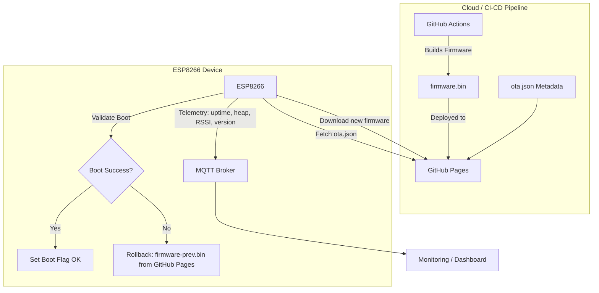

# ESP8266 OTA Pipeline with Rollback and MQTT Telemetry

This project demonstrates a DevOps-inspired pipeline for **safe Over-The-Air (OTA) firmware updates** on ESP8266 devices.  
It combines **CI/CD practices** with **rollback safety mechanisms** and **real-time telemetry reporting** over MQTT.

---

## Features

- **Automatic OTA Delivery**  
  New firmware is built via GitHub Actions and deployed to GitHub Pages for distribution.

- **Firmware Rollback**  
  If an update fails to boot, the ESP8266 automatically rolls back to the previous firmware version.

- **Boot Validation**  
  Each firmware version is validated at startup before being marked as stable.

- **MQTT Telemetry**  
  Device health metrics are published periodically:
  - Uptime
  - Free heap memory
  - Wi-Fi RSSI
  - Running firmware version

---

## Architecture

